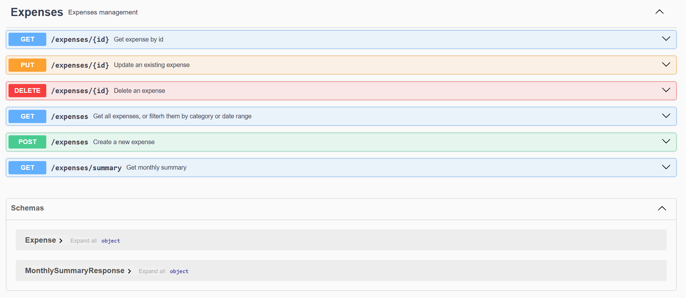

# Expense Tracker API


A REST API built with **Spring Boot** for managing personal expenses.

This project demonstrates the development of a **clean and well-structured backend API**, including validation, exception handling, filtering, and documentation with Swagger.

---

# Features

- Create, update and delete expenses
- Retrieve expenses by ID
- Filter expenses by category
- Filter expenses by month
- Calculate monthly expense summary
- Input validation using Bean Validation
- Global exception handling
- Interactive API documentation with Swagger
- In-memory database with H2

---

# Tech Stack

- **Java 21**
- **Spring Boot**
- **Spring Web**
- **Spring Data JPA**
- **H2 Database**
- **Bean Validation**
- **Lombok**
- **Swagger / OpenAPI**
- **Maven**

---

# Architecture

The application follows a **layered architecture**:
Client
↓
Controller
↓
Service
↓
Repository
↓
Database

This separation improves:

- maintainability
- readability
- scalability

---

# Project Structure
src/main/java/com/chrisferrari/expense_tracker

controller
ExpenseController

service
ExpenseService

repository
ExpenseRepository

entity
Expense
Category

dto
ExpenseRequest
MonthlySummaryResponse

exception
GlobalExceptionHandler
ResourceNotFoundException
---

# Swagger details

The API is documented using **Swagger UI**.



# Running the Project

Clone the repository:

```bash
git clone https://github.com/your-username/expense-tracker.git

Navigate into the project directory:
```bash
cd expense-tracker

Run the application
```bash
mvn spring-boot:run

The application will start at:
http://localhost:8080
